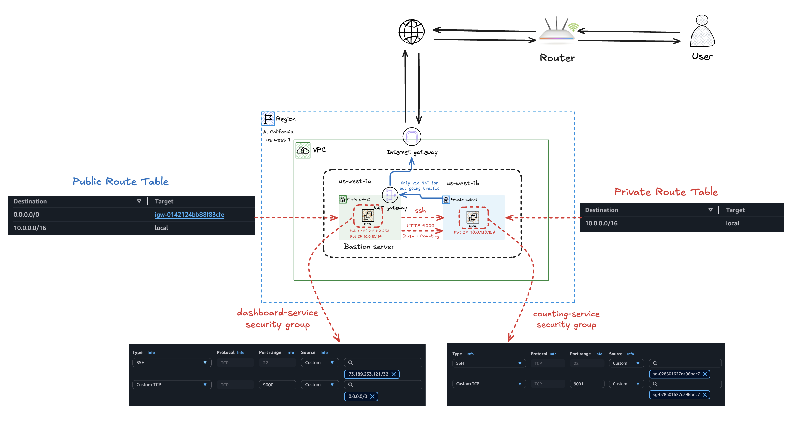

# AWS Two-Tier VPC Architecture with Terraform

A production-grade AWS infrastructure provisioned from scratch using Terraform — no modules, every resource hand-written and understood. Built as a learning project covering networking, security, and compute provisioning on AWS `us-west-1`.

---

## Architecture Overview



## Working Demo

https://github.com/user-attachments/assets/81cbc011-c7f8-417a-9aa0-1465383f8e5f

**Traffic flows:**

- User → `bastion-public-ip:9000` → dashboard service
- Dashboard → `app-server-private-ip:9001` → counting service
- App server outbound → NAT Gateway → Internet (updates, packages)
- SSH: `your-ip:22` → bastion → app server (agent forwarding, no key copy)

---

## File Structure

```
dashboard-counting-app/
├── versions.tf          # Provider versions + Terraform version lock
├── variables.tf         # Input variable declarations (types + descriptions)
├── terraform.tfvars     # Actual values — gitignored, never commit
├── vpc.tf               # VPC resource
├── igw.tf               # Internet Gateway
├── subnets.tf           # Public subnet (us-west-1a) + Private subnet (us-west-1c)
├── nat-gateway.tf       # Elastic IP + NAT Gateway
├── route-tables.tf      # Public RT (→ IGW) + Private RT (→ NAT) + associations
├── security-group.tf    # Bastion SG + App server SG
├── ssh-key.tf           # RSA key pair generation + .pem saved locally
├── data.tf              # Latest Amazon Linux 2 AMI lookup
├── bastion.tf           # Public EC2 + dashboard-service startup
├── app-server.tf        # Private EC2 + counting-service startup
├── outputs.tf           # IPs, SSH commands, dashboard URL
└── .gitignore           # *.pem, *.tfstate, *.tfvars, .terraform/
```

**Why one file per resource group (not everything in `main.tf`):**

- When a security group rule changes, you open `security-group.tf` — not hunt through 500 lines
- PR reviews are focused — a NAT gateway change touches only `nat-gateway.tf`
- Easier to `grep` for specific resource types across a large codebase

---

## What Was Learned

### Terraform Fundamentals

- **Dependency graph** — Terraform resolves resource creation order automatically from references like `aws_vpc.main.id`. Explicit `depends_on` only needed when dependencies aren't visible in arguments
- **Resource vs data source** — `resource` creates infrastructure, `data` reads existing AWS information without creating anything
- **Variable separation** — `variables.tf` declares types/descriptions, `terraform.tfvars` holds actual values. Change one file for different environments
- **`~>` version constraint** — `~> 5.0` means "5.anything but not 6", preventing surprise breaking changes
- **`path.module`** — built-in Terraform variable pointing to the directory of your `.tf` files
- **`nohup env KEY=VALUE ./binary`** — `nohup` is not a shell and doesn't understand `KEY=VALUE command` syntax. `env` is needed as a middleman to set environment variables before launching a process

### AWS Networking Concepts

- **VPC** — private network boundary. `enable_dns_hostnames = true` required for EC2 hostnames and some AWS services
- **Internet Gateway** — attachment point connecting VPC to internet. The IGW is the door; route tables are the signs that say which subnet uses it
- **Subnets across AZs** — `us-west-1` only has `us-west-1a` and `us-west-1c` (no `us-west-1b`). Splitting public/private across AZs improves fault isolation
- **`map_public_ip_on_launch`** — `true` on public subnet auto-assigns public IPs to EC2 instances. `false` on private subnet means no public IP ever, even if someone tries
- **Route tables** — two separate tables required. Public: `0.0.0.0/0 → IGW`. Private: `0.0.0.0/0 → NAT`. Route table associations are the glue between tables and subnets
- **NAT Gateway** — sits in public subnet, serves private subnet. Allows outbound traffic from private instances without exposing them to inbound connections. Requires an Elastic IP
- **Elastic IP** — static public IP reserved for your account. NAT gateway uses this as its consistent outbound identity. `depends_on = [aws_internet_gateway.main]` needed because AWS requires IGW before EIP allocation
- **Cross-AZ NAT** — NAT gateway in `us-west-1a` serving private subnet in `us-west-1c` works but incurs cross-AZ data transfer costs in production

### Security Groups

- **Stateful firewalls** — if you allow inbound SSH, the response is automatically allowed out. No need for explicit outbound rule per connection
- **Security group referencing** — `security_groups = [aws_security_group.bastion.id]` is identity-based, not IP-based. Better than CIDR rules because it survives IP changes and is more precise
- **`protocol = "-1"`** — means all protocols. Combined with `from_port = 0` and `to_port = 0` = allow all outbound
- **Principle of least privilege** — bastion: SSH from your IP only + port 9000 public. App server: SSH and 9001 from bastion SG only, nothing else

### SSH & Key Management

- **`tls_private_key`** generates RSA key pair in Terraform memory. Public half goes to AWS, private half saved locally as `.pem`
- **`file_permission = "0600"`** — SSH refuses keys readable by others. Owner read/write only
- **Agent forwarding (`-A`)** — forwards your local SSH agent to the bastion. Lets you SSH bastion → app server without copying `.pem` onto bastion
- **`ssh-add key.pem`** — loads key into your local SSH agent so `-A` forwarding actually works
- **State security warning** — `tls_private_key` stores private key in `terraform.tfstate` in plaintext. Always add `*.tfstate` to `.gitignore`. Use Vault or Secrets Manager for production

### AWS Credentials & CLI

- AWS CLI profile `[hello-cloud-lab]` vs `[default]` — Terraform uses `[default]` unless `AWS_PROFILE` is set
- `export AWS_PROFILE=hello-cloud-lab` — makes Terraform use the named profile for the session
- `aws sts get-caller-identity` — fastest way to verify credentials are working before running Terraform

---

## Prerequisites

- Terraform `>= 1.0` — [install](https://developer.hashicorp.com/terraform/install)
- AWS CLI configured with sufficient permissions
- IAM user needs: `AmazonEC2FullAccess`, `AmazonVPCFullAccess`

---

## Configuration

Copy and edit the variables file:

```bash
cp terraform.tfvars.example terraform.tfvars
```

| Variable              | Description                   | Example                  |
| --------------------- | ----------------------------- | ------------------------ |
| `aws_region`          | AWS region                    | `us-west-1`              |
| `vpc_cidr`            | VPC CIDR block                | `10.0.0.0/16`            |
| `public_subnet_cidr`  | Public subnet CIDR            | `10.0.10.0/24`           |
| `private_subnet_cidr` | Private subnet CIDR           | `10.0.130.0/24`          |
| `public_az`           | AZ for public subnet          | `us-west-1a`             |
| `private_az`          | AZ for private subnet         | `us-west-1c`             |
| `my_ip`               | Your IP for SSH access        | `73.x.x.x/32`            |
| `instance_type`       | EC2 instance type             | `t2.micro`               |
| `key_name`            | SSH key pair name             | `dashboard-counting-key` |
| `project_name`        | Prefix for all resource names | `dashboard-counting`     |

> ⚠️ **`us-west-1` only has `us-west-1a` and `us-west-1c`** — `us-west-1b` does not exist and will error on subnet creation.

---

## Deploy

```bash
# 1 — download providers (aws, tls, local)
terraform init

# 2 — preview what will be created (~23-25 resources)
terraform plan

# 3 — build everything
terraform apply

# 4 — print outputs after apply
terraform output
```

Expected output after apply:

```
app_server_private_ip = "10.0.130.x"
bastion_private_ip    = "10.0.10.x"
bastion_public_ip     = "3.101.x.x"
nat_gateway_public_ip = "52.8.x.x"
vpc_id                = "vpc-0xxxxxxxxx"
ssh_to_bastion        = "ssh -i dashboard-counting-key.pem -A ec2-user@3.101.x.x"
ssh_to_app_server     = "ssh ec2-user@10.0.130.x"
dashboard_url         = "http://3.101.x.x:9000"
```

---

## Connecting to Servers

### SSH into bastion

```bash
# Load key into SSH agent first (required for agent forwarding)
ssh-add dashboard-counting-key.pem

# SSH with agent forwarding enabled
ssh -i dashboard-counting-key.pem -A ec2-user@<bastion-public-ip>
```

### SSH into app server (from inside bastion)

```bash
ssh ec2-user@<app-server-private-ip>
```

No `.pem` file needed on the bastion — agent forwarding carries your local key.

---

## Services

Both services are Go static binaries from [hashicorp/demo-consul-101](https://github.com/hashicorp/demo-consul-101/releases/tag/0.0.3.1). Being statically compiled Go binaries, they have no OS or glibc dependencies and run on any Linux x86_64 system.

| Service   | Host                 | Port | Binary                          |
| --------- | -------------------- | ---- | ------------------------------- |
| Dashboard | Bastion (public)     | 9000 | `dashboard-service_linux_amd64` |
| Counting  | App server (private) | 9001 | `counting-service_linux_amd64`  |

### Start dashboard (on bastion)

```bash
nohup env PORT=9000 COUNTING_SERVICE_URL="http://<app-server-private-ip>:9001" \
  ./dashboard-service_linux_amd64 > ~/dashboard-service.log 2>&1 &
```

### Start counting service (on app server)

```bash
nohup env PORT=9001 ./counting-service_linux_amd64 > ~/counting-service.log 2>&1 &
```

### Verify services are running

```bash
# Check process
ps aux | grep dashboard-service
ps aux | grep counting-service

# Check port binding
sudo ss -tlnp | grep 9000
sudo ss -tlnp | grep 9001

# Check logs
cat ~/dashboard-service.log
cat ~/counting-service.log
```

### Why `nohup env KEY=VALUE ./binary` and not `nohup KEY=VALUE ./binary`

`nohup` is not a shell — it doesn't understand `KEY=VALUE command` syntax. It treats `KEY=VALUE` as the command name and tries to execute a program called `KEY=VALUE`, which doesn't exist. `env` is the middleman: it sets environment variables then launches the binary with those variables in its environment.

```bash
# WRONG — nohup tries to run "PORT=9000" as a program
nohup PORT=9000 ./dashboard-service_linux_amd64

# CORRECT — env sets PORT=9000, then launches the binary
nohup env PORT=9000 ./dashboard-service_linux_amd64
```

---

## Security Notes

- Bastion SSH access is restricted to `my_ip` only (`/32` CIDR)
- App server has no public IP — unreachable from internet by design
- App server security group only accepts traffic from bastion security group (identity-based, not IP-based)
- Private key is stored in `terraform.tfstate` in plaintext — never commit state files
- For production: use AWS Secrets Manager or HashiCorp Vault for key management

---

## Teardown

```bash
terraform destroy
```

> ⚠️ **NAT Gateway bills ~$0.045/hour even when idle.** Always destroy when done with a lab environment. Unlike EC2, NAT gateways cannot be stopped — only destroyed.

---

## Lessons from Debugging

| Error                                         | Cause                                   | Fix                                 |
| --------------------------------------------- | --------------------------------------- | ----------------------------------- |
| `No valid credential sources found`           | AWS CLI not configured or wrong profile | `export AWS_PROFILE=<profile-name>` |
| `availabilityZone us-west-1b is invalid`      | `us-west-1b` doesn't exist              | Use `us-west-1c` for second AZ      |
| `nohup: failed to run command 'PORT=9000'`    | `nohup` doesn't handle inline env vars  | Use `nohup env PORT=9000 ./binary`  |
| `Permission denied (publickey)` on app server | SSH agent not loaded                    | Run `ssh-add key.pem` before SSHing |
| `/var/log/x.log: Permission denied`           | `/var/log` owned by root                | Write logs to `~/` instead          |

---

## Resources

- [Terraform AWS Provider Docs](https://registry.terraform.io/providers/hashicorp/aws/latest/docs)
- [AWS VPC Documentation](https://docs.aws.amazon.com/vpc/latest/userguide/)
- [hashicorp/demo-consul-101](https://github.com/hashicorp/demo-consul-101)
- [SSH Agent Forwarding Guide](https://docs.github.com/en/authentication/connecting-to-github-with-ssh/using-ssh-agent-forwarding)
